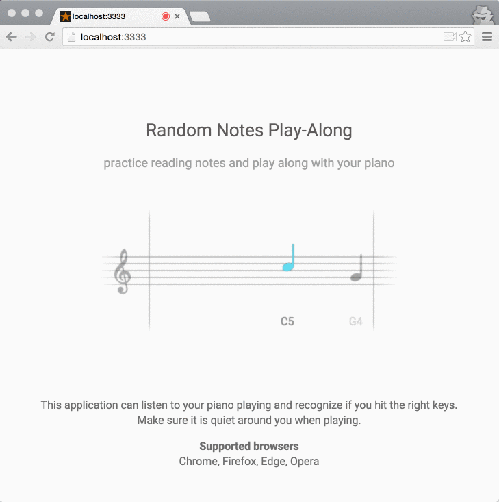

# note-practice

Practice reading and playing notes

### Setup
You need git and npm. Bower and Brunch should be installed locally when running `npm install`

Install npm dependencies: `npm install`

### Build & development

Run `npm start`

This builds the project and starts a local server for development purposes at `http://localhost:3333`

### Production build

Run `npm run-script build`

This builds the project with production settings and outputs into the `public` directory

### Made possible by
- https://github.com/cwilso/PitchDetect
- https://github.com/markmarijnissen/PitchDetect

#### Fun facts
- This project started as a small project during the christmas holidays, because I wanted a more fun way to practice sight-reading piano notes instead of the classic "flash-card" versions around on the internet. Somewhat inspired by [Yousician](http://get.yousician.com/).
- The first P.O.C. was built in a day, and the first release-version on github was done in ~3 days.